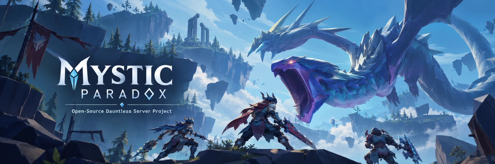

  

<h1 align="center">Mystic Paradox</h1>

  <b>Open-source private server for Dauntless</b> — backend, game-server orchestration, launcher and runtime
  compatibility layer, so you can run the game on a server of your own.

  
  
  
  
  

  <a href="#-get-started">Get started</a> ·
  <a href="#-documentation">Docs</a> ·
  <a href="docs/FAQ.md">FAQ</a> ·
  <a href="#-community-and-help">Community</a> ·
  <a href="docs/DAUNTLESS_1_14_7_PORT.md">1.14.7 progress</a>

> [!IMPORTANT]
> Unofficial and community-developed. Not affiliated with, endorsed by, or sponsored by Phoenix Labs,
> Epic Games, Forte Labs, or any current or former Dauntless rights holder. This repository ships
> **source code only** — no game files, SDK or game data.

## 📊 Status

| Game version | State |
|---|---|
| **Dauntless 1.14.7** (CL `647472`) | 🚧 `main` is moving to 1.14.7 one component at a time: runtime, tools, backend and Director are done; the launcher is next. Hubs, dedicated hunts and saved hunt rewards work — [progress notes](docs/DAUNTLESS_1_14_7_PORT.md) |
| **Dauntless 1.12.0** (CL `392819`) | ✅ Alpha, self-hostable — build it from the [`dauntless-1.12.0`](https://github.com/pranav158/Mystic-Paradox/tree/dauntless-1.12.0) tag |

Expect active development, not production-grade uptime.

> [!NOTE]
> `main` is between versions: its runtime, backend and Director target 1.14.7 while the launcher and the guides
> below still describe 1.12.0. For a working 1.12.0 setup, check out the `dauntless-1.12.0` tag.

## 🚀 Get started

1. **Read the [FAQ](docs/FAQ.md)** — what the project is, what it isn't, and where to get help.
2. **Generate the SDK** from your own 1.12.0 install — [Generating the SDK](docs/GENERATING_SDK.md).
3. **Generate the game data** from the same install — [Generating game data](docs/GENERATING_GAME_DATA.md).
4. **Deploy and play** — [Self-hosting](docs/SELF_HOSTING.md) walks from source to Ramsgate:
   prerequisites, DNS/TLS, services, launcher and the first acceptance test.

## 📚 Documentation

| Guide | What's inside |
|---|---|
| 🏠 [Self-hosting](docs/SELF_HOSTING.md) | Full deployment: prerequisites, configuration helper, ports, validation, troubleshooting |
| 🧩 [Generating the SDK](docs/GENERATING_SDK.md) | Dumping the Unreal SDK with Dumper-7 and building the C++ projects |
| 📦 [Generating game data](docs/GENERATING_GAME_DATA.md) | Exporting the catalogue and tables from your install |
| 🔭 [1.14.7 port](docs/DAUNTLESS_1_14_7_PORT.md) | Progress, findings and open issues for the final game release |
| ❓ [FAQ](docs/FAQ.md) | Common questions, support and contact |
| ⚖️ [Scope and legal](docs/SCOPE_AND_LEGAL.md) | What isn't included, responsible use, license details |
| 🔒 [Security](SECURITY.md) | Safe configuration and how to report a vulnerability |
| 🖥️ [Launcher](ParadoxLauncher/README.md) · [Update channel](ParadoxLauncher/UPDATE_CHANNEL.md) | Building, signing and publishing the launcher and runtime |

## 🗂️ Repository layout

| Folder | What it is |
|---|---|
| [`ParadoxBackend`](ParadoxBackend) | Account and metagame backend (login, characters, inventory, progression, store, party…) — Node/TypeScript + MongoDB |
| [`ParadoxDirector`](ParadoxDirector) | Starts and supervises the dedicated game servers for hubs and hunts |
| [`ParadoxRuntime`](ParadoxRuntime) | C++ DLL injected into the client and servers to adapt them to the private backend (MSVC + MinHook) |
| [`ParadoxLauncher`](ParadoxLauncher) | Windows launcher: sign-in, install checks, signed runtime updates, game sessions (Tauri) |
| [`tools/RuntimeLoader`](tools/RuntimeLoader) | `winmm.dll` proxy that loads the runtime at startup |
| [`tools/CatalogExporter`](tools/CatalogExporter) | Exports compatibility data from your own installation |

## 💬 Community and help

- 🐛 **Bugs, feature requests and testing feedback:** open a [GitHub issue](../../issues). Include the
  component, commit, configuration with secrets removed, reproduction steps and logs.
- 💬 **Discord:** add **`uwumystic`**. Please include a short note with your friend request explaining
  why you're reaching out, so project requests don't get lost among unrelated ones.
- 🔒 **Security problems:** report them privately — see [SECURITY.md](SECURITY.md).

Pull requests are welcome. Never submit game files, leaked source or secrets. Project support is not
provided on Reddit.

## 📜 License and credits

[AGPL-3.0-only](LICENSE), with additional terms in [ADDITIONAL_TERMS.md](ADDITIONAL_TERMS.md) — details in
[Scope and legal](docs/SCOPE_AND_LEGAL.md).

- Based on **[Undaunted](https://github.com/SyST3MDeV/Undaunted)** by gwog / Gregory Morford (AGPLv3).
- **Mystic Paradox** is a separate community project with substantial independent changes, maintained
  by **Mystic / Pranav Karande**.
- Development assistance: [Claude](https://www.anthropic.com/claude) (Anthropic).

Full provenance in [NOTICE.md](NOTICE.md).

Made by the community, for the Slayers who aren't ready to say goodbye. 🗡️

